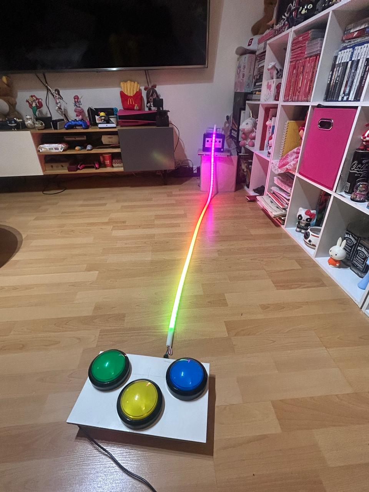
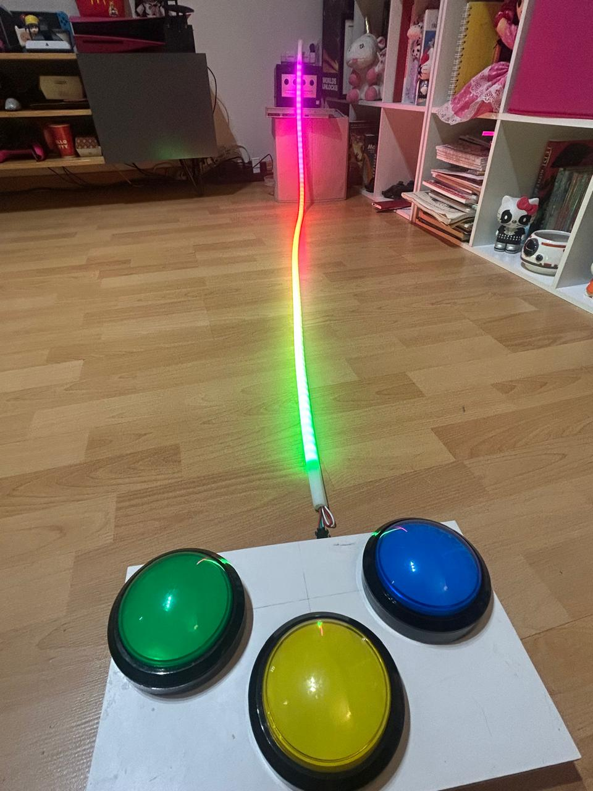
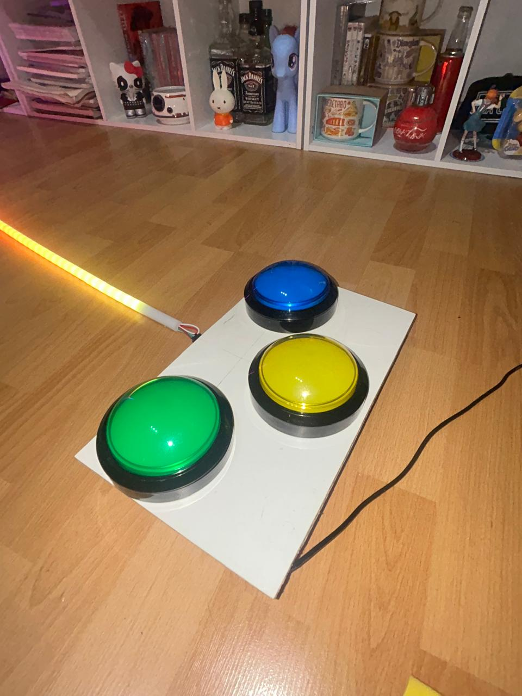
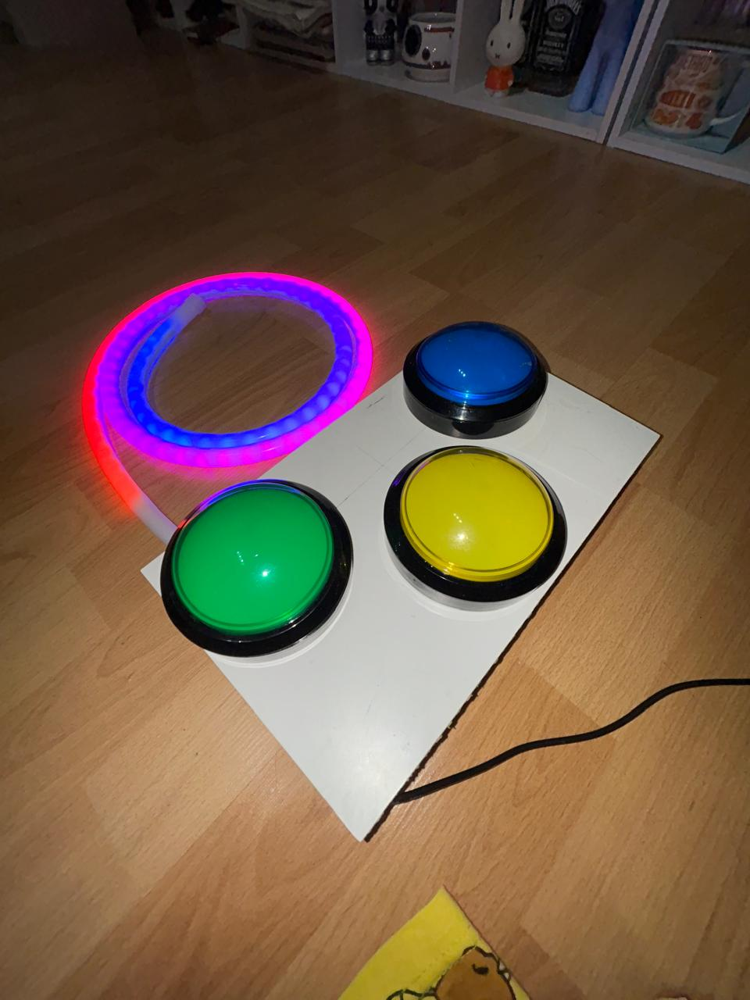
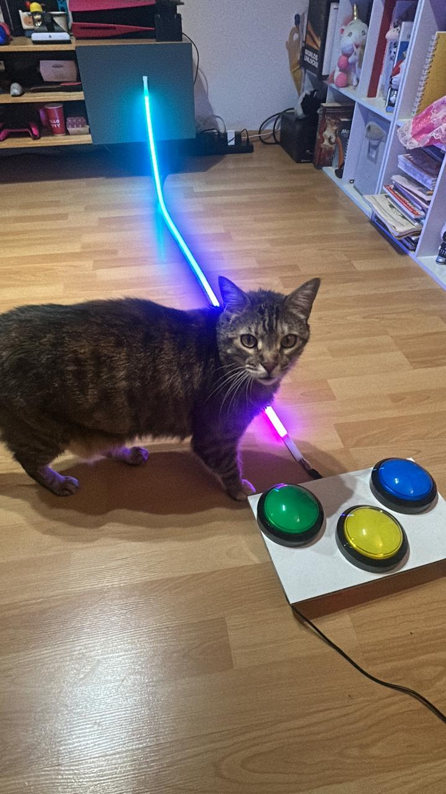

# ESP32 LED Boss Fight

  

A real-time embedded game system prototyped in Python and implemented on ESP32 using WS2812B LEDs, button input, and event-driven audio.

  

  <strong>Try the web demo in real time now.</strong>

---

## Prototype gallery

  
  
  
  

---

## Hardware preview
<h6 align="center">(I swear there’s an ESP32 under there)</h6>

  
  

  <a href="https://vt.tiktok.com/ZSHvuQUue/">TikTok Demo</a> •
  <a href="https://www.instagram.com/reel/DX0R08eD1mK/?igsh=YzhlYWJyamJ4bzRu">Instagram Reel</a>

  
  

---

## Quick links
- [Firmware](firmware/esp32_led_boss_fight.ino)
- [Hardware](hardware/README.md)
- [Gallery](gallery/README.md)
- [Web Demo](web-demo/README.md)

---

## Portfolio highlights
- Embedded systems development
- Real-time game logic
- Collision handling
- Event-driven programming
- Audio feedback systems
- Hardware input integration
- LED rendering and interaction
- Rapid prototyping from Python to embedded hardware
- Technical debugging and iteration

---

## Project overview
This project started as a Python gameplay prototype and evolved into an ESP32-based interactive game using a 100-pixel WS2812B LED strip, three color-coded buttons, and buzzer-based sound feedback.

The game combines:
- boss and minion wave logic
- color-matched projectiles
- real-time collision handling
- progressive difficulty scaling
- event-based sound cues
- simple but readable state-based architecture

---

## Core systems

### State machine
The game is organized around three runtime phases:
- `hiatus`
- `spawning`
- `playing`

This structure keeps gameplay flow clear, modular, and easier to debug.

### Collision system
Projectile positions are checked against minion positions in real time.

Behavior includes:
- successful hit when projectile color matches enemy color
- enemy removal on valid hit
- penalty when colors do not match
- penalty when a projectile exits the LED range without a hit

### Difficulty scaling
The game becomes more difficult by reducing enemy movement delay after each cleared wave.

This creates:
- faster pacing
- increased pressure
- escalating challenge with the same control scheme

### Audio feedback
The buzzer is used for gameplay events including:
- shooting
- valid hit
- failed hit or miss
- boss intro
- victory

---

## Technical skills demonstrated

### Programming
- C++
- Python
- JavaScript
- HTML
- CSS

### Embedded and hardware
- ESP32
- Arduino-style firmware development
- WS2812B LED control
- button input handling
- buzzer audio output

### Engineering and design
- real-time systems thinking
- state-based logic
- collision design
- interaction design
- iterative prototyping
- hardware/software translation
