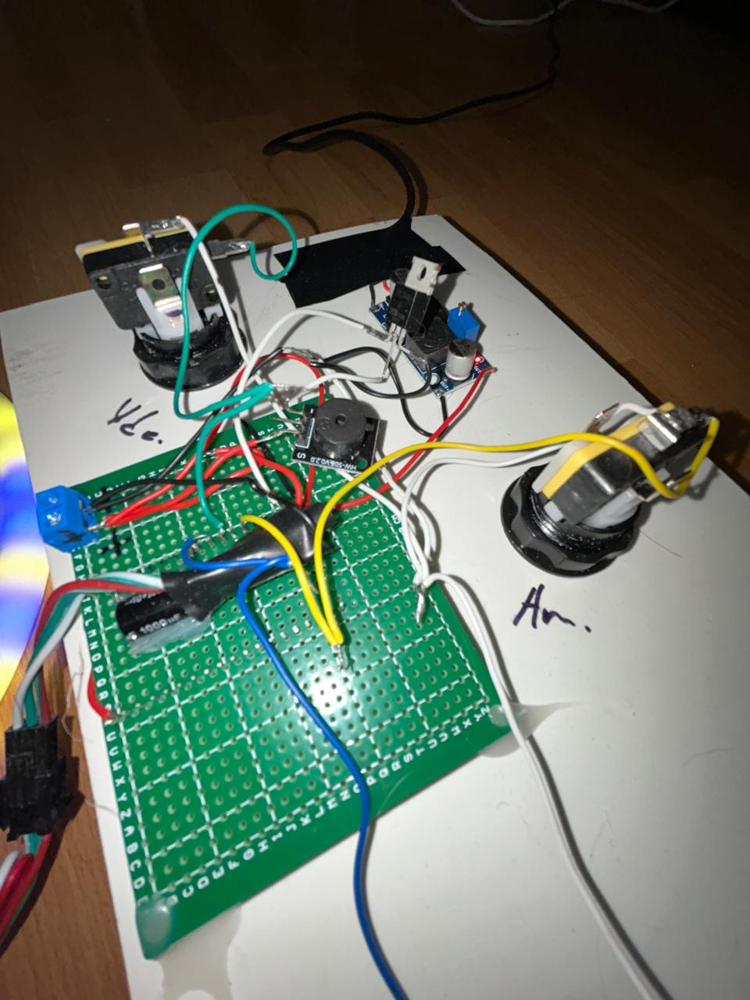
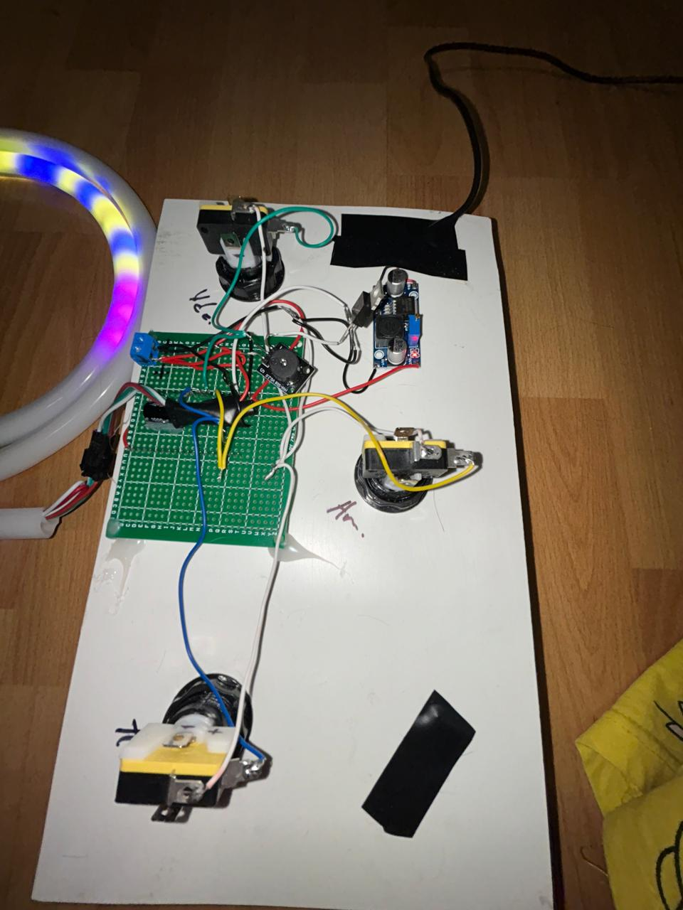

## Hardware preview

  
  

# Wiring and pinout

## ESP32 pin mapping

| Component | Signal / Function | ESP32 Pin | Notes |
|---|---|---:|---|
| WS2812B LED strip | Data In | GPIO 5 | Main LED data line |
| Blue button | Input | GPIO 14 | `INPUT_PULLUP` |
| Green button | Input | GPIO 27 | `INPUT_PULLUP` |
| Yellow button | Input | GPIO 26 | `INPUT_PULLUP` |
| Passive buzzer | Signal | GPIO 25 | Tone output |
| All buttons | Ground | GND | Common ground |
| LED strip | Power | 5V | External 5V recommended |
| LED strip | Ground | GND | Shared ground with ESP32 |

## Button wiring

| Button color | One side | Other side | Notes |
|---|---|---|---|
| Blue | GPIO 14 | GND | Uses internal pull-up |
| Green | GPIO 27 | GND | Uses internal pull-up |
| Yellow | GPIO 26 | GND | Uses internal pull-up |

## LED strip wiring

| LED strip wire | Connects to | Notes |
|---|---|---|
| Data | GPIO 5 | Data input to first LED |
| 5V | External 5V | Do not rely on ESP32 5V for long strips |
| GND | Common GND | Must be shared with ESP32 ground |

## Buzzer wiring

| Buzzer pin | Connects to | Notes |
|---|---|---|
| Signal | GPIO 25 | Used for gameplay tones |
| Ground | GND | Common ground |
